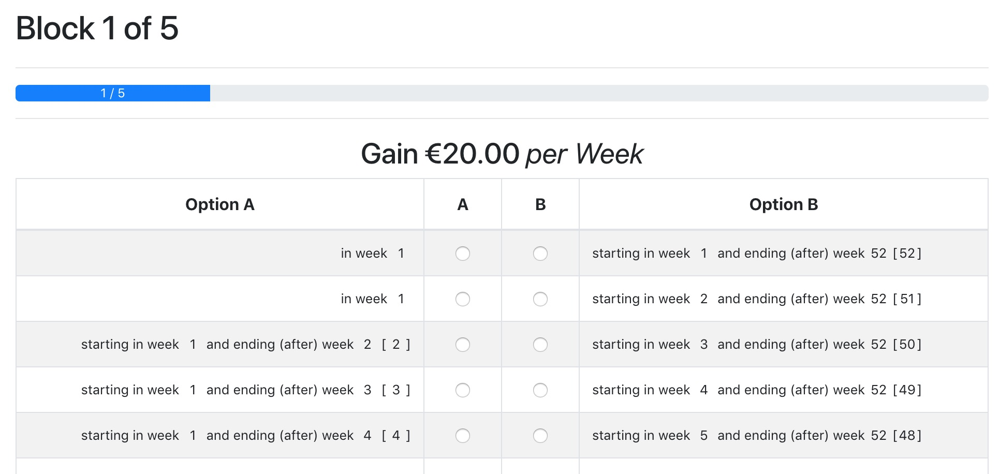
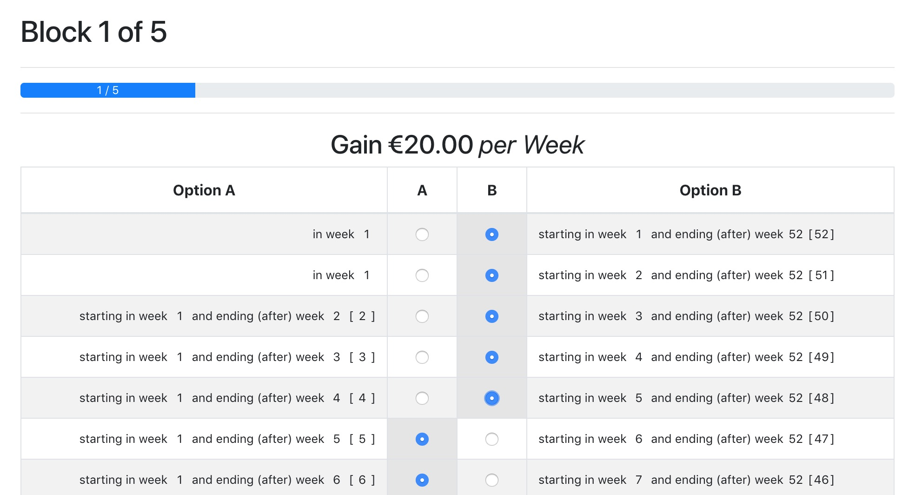
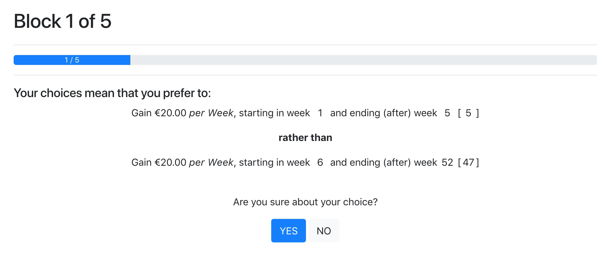

# otdm - Direct Method for otree

otdm provides an easy way of creating experiments to measure the temporal discounting of money using the Direct Method (DM) [Attema et al., 2016] for [otree](http://www.otree.org) by just editing a single configuration file (see [`config.py`](./config.py)).

## Features

By editing [`config.py`](./config.py) you can easily generate an app in order to apply the Direct Method. The player will be presented with a total of five blocks with multiple choices of preference each as shown below:

Selecting one option will automatically set the other radio buttons correctly:

Before really advancing to the next block the user will be faced with a confirmation message in order to affirm his selection:

